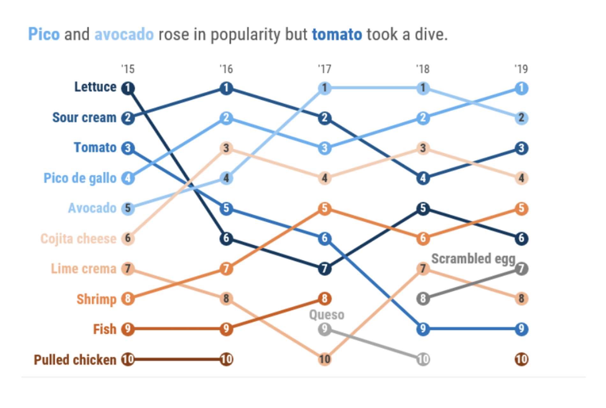
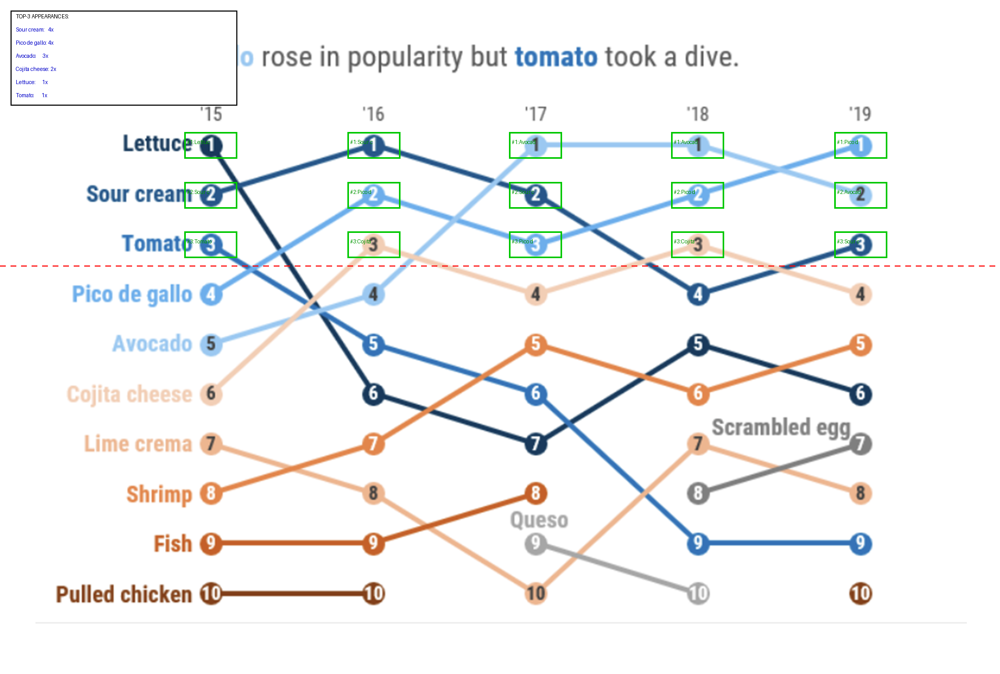

# Methodical Approach: q54 — Taco Ingredients Bump Chart

## Setup

**Model:** Claude Sonnet 4.6
**Harness:** `claude -p` (CLI print mode, non-interactive)
**Tools:** Read (view images), Bash (run Python scripts)
**Prompt:** Same methodical 4-step prompt (Analyze → Plan → Compute → Answer)

---

## The Problem

**Question:** Suppose the ranking is based on the number of times that food appears as the top-3 best ingredients for a taco. What are the food items that are tied for the most number of top-3 appearances?
**Gold answer:** Sour cream and Pico de gallo
**Image:** `original.png`



A bump chart with 10 food items ranked across 5 years ('15-'19). Lines cross frequently and use similar blue-spectrum colors — hard to track visually which line is which across crossings.

| Approach | Answer | Turns | Time |
|----------|--------|-------|------|
| Read only | **Lettuce, Sour cream** (wrong) | ~6 | ~50s |
| **Read+Bash+Plan** | **Sour cream and Pico de gallo** (correct) | 13 | 287s |

---

## What the Model Did

### Step 1 — Analyze
Reads the image. Identifies a bump chart: 10 taco ingredients, ranked 1-10 across 5 years.

### Step 2 — Plan
> "Find year column x-positions, rank row y-positions, sample the color at each intersection, match to known food items, count top-3 appearances."

### Step 3 — Execute

**Locate the grid** — Scans for colored pixel clusters to find 5 year-column x-positions and 10 rank y-positions per year.

**Establish color palette** — Samples RGB values at each rank position in the '15 column (where items are in known order from the labels) to build a color-to-food mapping:
```
Lettuce:       RGB(31, 62, 95)   — dark navy
Sour cream:    RGB(53, 98, 145)  — medium blue
Tomato:        RGB(204, 102, 0)  — orange
Pico de gallo: RGB(70, 130, 180) — steel blue
...
```

**Match across years** — At each year×rank position, samples the color and matches to the closest known food via Euclidean distance. Builds the full rankings table.

**Count top-3** — Tallies how many times each item ranks 1st, 2nd, or 3rd:
```
Sour cream:    4 times ('15 #2, '16 #1, '17 #2, '19 #3)
Pico de gallo: 4 times ('16 #2, '17 #3, '18 #2, '19 #1)
Lettuce:       3 times
Tomato:        3 times
```

**Annotate** — Draws green boxes around top-3 positions, a dashed red line at rank 3, and a tally in the corner:



### Step 4 — Answer
> **Sour cream and Pico de gallo** — both with 4 top-3 appearances, tied for most.

---

## Why Read-Only Failed

The bump chart has 10 crossing lines in similar blue shades. Read-only confused Pico de gallo's line with other blue-spectrum items and miscounted its top-3 appearances. The computation resolved this by sampling exact RGB values at each intersection point and matching against a calibrated color palette — distinguishing colors that differ by only 20-30 RGB units.
