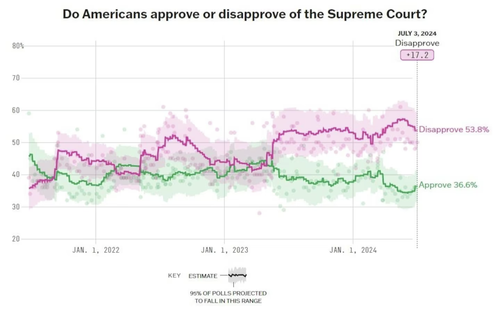
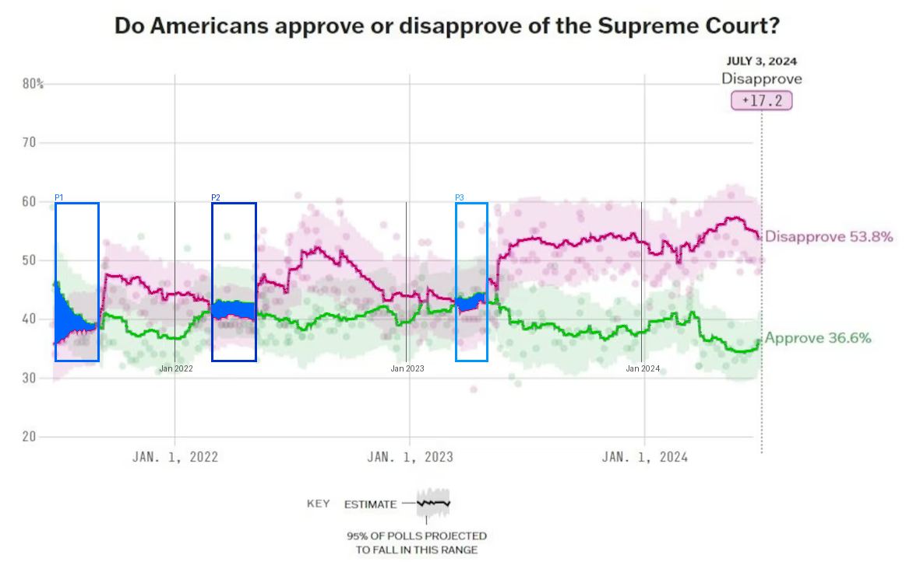
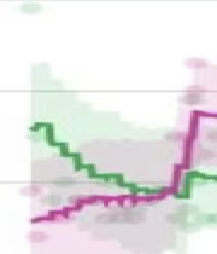
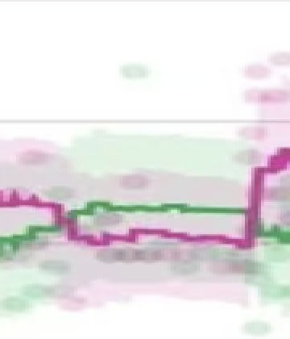
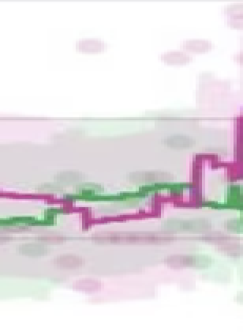

# Methodical Approach: Plan → Compute → Annotate → Answer

## Setup

**Model:** Claude Sonnet 4.6  
**Harness:** `claude -p` (CLI print mode, non-interactive)  
**Tools:** Read (view images), Bash (run Python scripts)  
**System prompt:**
```
You are a chart analysis agent. Your goal is to answer a question about
a chart image, but you must NOT answer from visual impression alone.
Instead, follow this process:

STEP 1 — ANALYZE: Read the chart image. Understand chart type, axes, legend.
STEP 2 — PLAN: Plan a computational method to find the answer.
STEP 3 — EXECUTE: Write Python scripts to analyze pixels, annotate the image.
           Then Read the annotated image to verify visually.
STEP 4 — ANSWER: Answer grounded in computation, not visual impression.
```

---

## The Problem

**Question:** How many time periods show the Supreme Court's disapproval rating lower than its approval rating?  
**Gold answer:** 3  
**Image:** `original.png`



The approve and disapprove lines cross subtly — some crossings are only 8-16 pixels apart.

| Approach | Answer | Turns | Time |
|----------|--------|-------|------|
| Read only | **0** (wrong) | 2 | 20s |
| **Read+Bash+Plan** | **3** (correct) | 21 | 282s |

Read-only misses the crossings entirely — the model confidently says "disapproval is always above." Read+Bash+Plan gets there by planning a computational method before looking at the data.

---

## What the Model Did

### Step 1 — Analyze
Reads the image. Identifies: line chart, pink = disapprove, green = approve.

### Step 2 — Plan
> "For each x-column, find the y-coordinate of each line by color. Count contiguous segments where green is above pink."

### Step 3 — Execute

**Detect line colors** — Finds the trend line RGB values by sampling: pink `(186, 69, 145)`, green `(101, 164, 113)`.

**Measure positions** — For each of 880 x-columns, finds the median y of each line's pixels:

```
col  70: green_y=364, pink_y=441 → Approve > Disapprove (diff=77px)
col 120: green_y=417, pink_y=422 → Approve > Disapprove (diff=5px)
col 130: green_y=421, pink_y=397 → Disapprove > Approve (crossover!)
```

**Find segments** — Groups consecutive "approve > disapprove" columns:

```
Segment 1: cols 70-127  (~Jun-Sep 2021, 77px separation)
Segment 2: cols 272-330 (~Feb-May 2022, 16-24px separation)
Segment 3: cols 586-628 (~Mar-May 2023, 8-16px separation)
```

**Annotate** — Draws the findings on the image: line traces, blue segment boxes, date reference lines.



**Zoom and verify** — Creates 4x zooms of each segment to visually confirm the crossovers.





### Step 4 — Answer

> **3** time periods. Grounded in 880 pixel measurements across two independent color detection methods.

---

## Why It Matters

Segment 3 is 42 pixels wide with 8-16px line separation. Read-only can't see it — the model confidently says "disapproval is always above." The computation makes it impossible to miss: it checks every column and detects sign changes mathematically.

Same model, same tools. The structured prompt forces computation-first reasoning instead of impression-first guessing.
