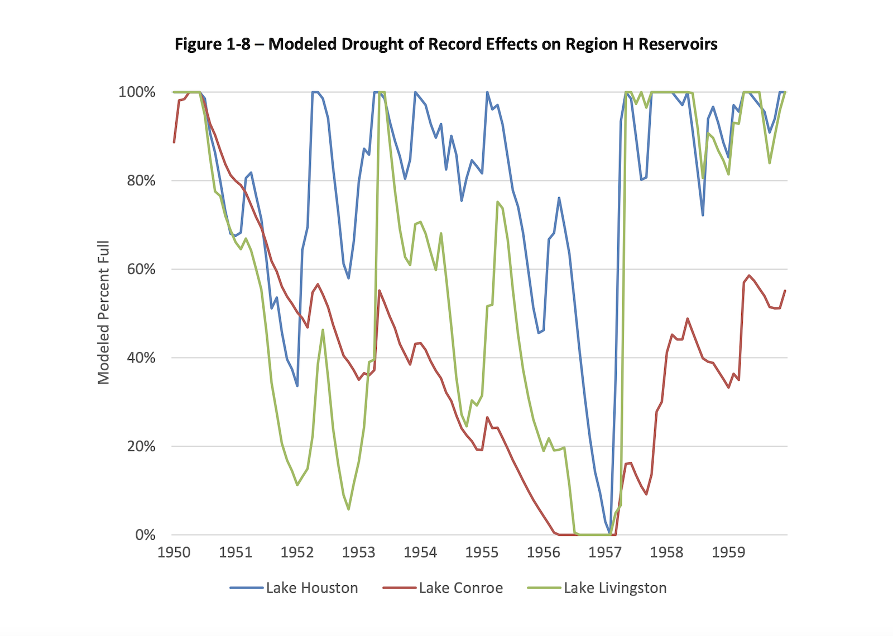
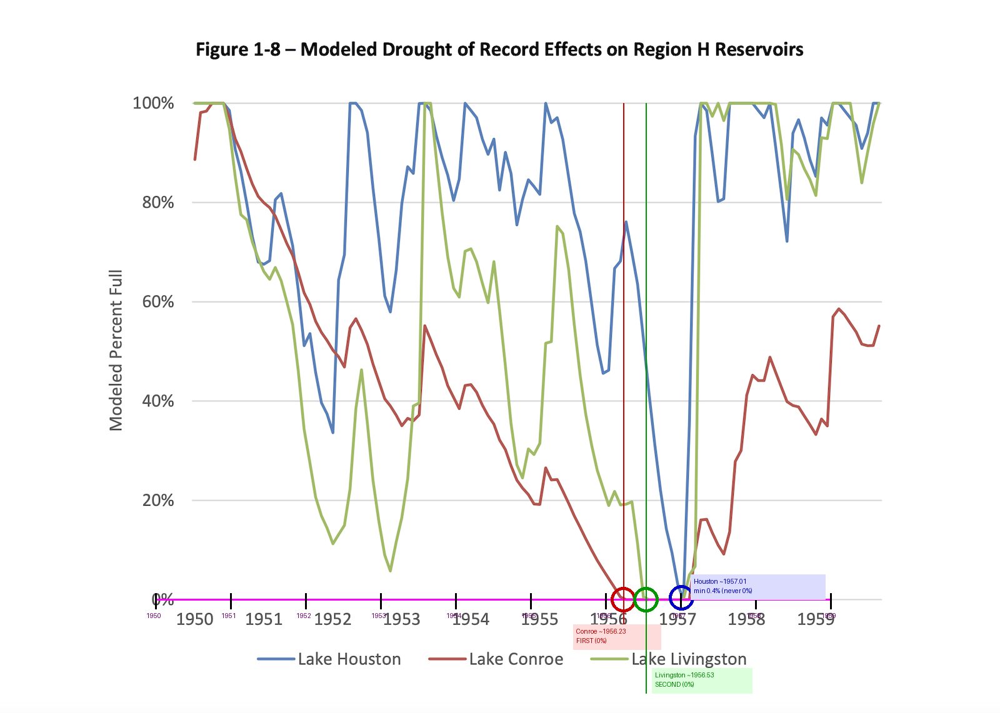

# Methodical Approach: q65 — Texas Drought Reservoir Chart

## Setup

**Model:** Claude Sonnet 4.6
**Harness:** `claude -p` (CLI print mode, non-interactive)
**Tools:** Read (view images), Bash (run Python scripts)
**Prompt:** Same methodical 4-step prompt (Analyze → Plan → Compute → Answer)

---

## The Problem

**Question:** Which reservoir was the first of the three to be depleted to or below the 40% full mark after reaching 90% or more?
**Gold answer:** Lake Conroe
**Image:** `original.png`



Three colored lines (blue = Lake Houston, red = Lake Conroe, green = Lake Livingston) show reservoir levels from 1950-1959. The lines cross frequently and two reservoirs hit 0% within months of each other — nearly impossible to distinguish visually which depletes first.

| Approach | Answer | Turns | Time |
|----------|--------|-------|------|
| Read only | **Lake Livingston** (wrong) | ~6 | ~50s |
| **Read+Bash+Plan** | **Lake Conroe** (correct) | 30 | 544s |

---

## What the Model Did

### Step 1 — Analyze
Reads the image. Identifies three reservoir lines with a legend at the bottom. Notes the lines are tangled and cross multiple times, especially near the 0% line around 1956-1957.

### Step 2 — Plan
> "Sample legend colors to identify each line. Trace each line across the chart. Find the earliest x-position where each line reaches 0%. Annotate and verify."

### Step 3 — Execute

**Identify line colors** — Samples the legend area to get RGB values for each reservoir:
- Lake Houston: blue `RGB(80, 121, 181)`
- Lake Conroe: red `RGB(175, 77, 70)`
- Lake Livingston: yellow-green `RGB(163, 187, 106)`

**Calibrate axes** — Finds gridlines and tick marks to establish the mapping:
- Y-axis: y=165 → 100%, y=960 → 0%
- X-axis: 120 pixels per year, starting at x=249 for 1950

The model initially got the x-axis scale wrong (94.6 px/year) and had to self-correct after the first annotation didn't match the tick marks — a key moment where computation caught its own error.

**Trace lines and find depletion points** — Scans each column for pixels matching each line's color (with tolerance). Records where each line first reaches y=960 (0%):

```
Lake Conroe (red):      x=997  → year ~1956.2 (early 1956) — FIRST
Lake Livingston (green): x=1033 → year ~1956.5 (mid 1956)  — SECOND
Lake Houston (blue):     never reaches 0% (min ~0.4%)       — NEVER
```

**Annotate and verify** — Draws circles at the depletion points and vertical reference lines:



The red circle (Lake Conroe) sits just left of the green circle (Lake Livingston) — confirming Conroe depleted first, by about 3 months.

### Step 4 — Answer
> **Lake Conroe** — first to reach 0%, at approximately early 1956.

---

## Why Read-Only Failed

Two problems:
1. **Line color confusion** — the model initially misidentified which line was which. The red and green lines cross multiple times near the bottom of the chart, making it easy to swap them.
2. **Temporal precision** — the two depletion events are ~3 months apart on a 10-year chart. At the chart's resolution, they appear nearly simultaneous. Only pixel-level measurement can determine which comes first.
