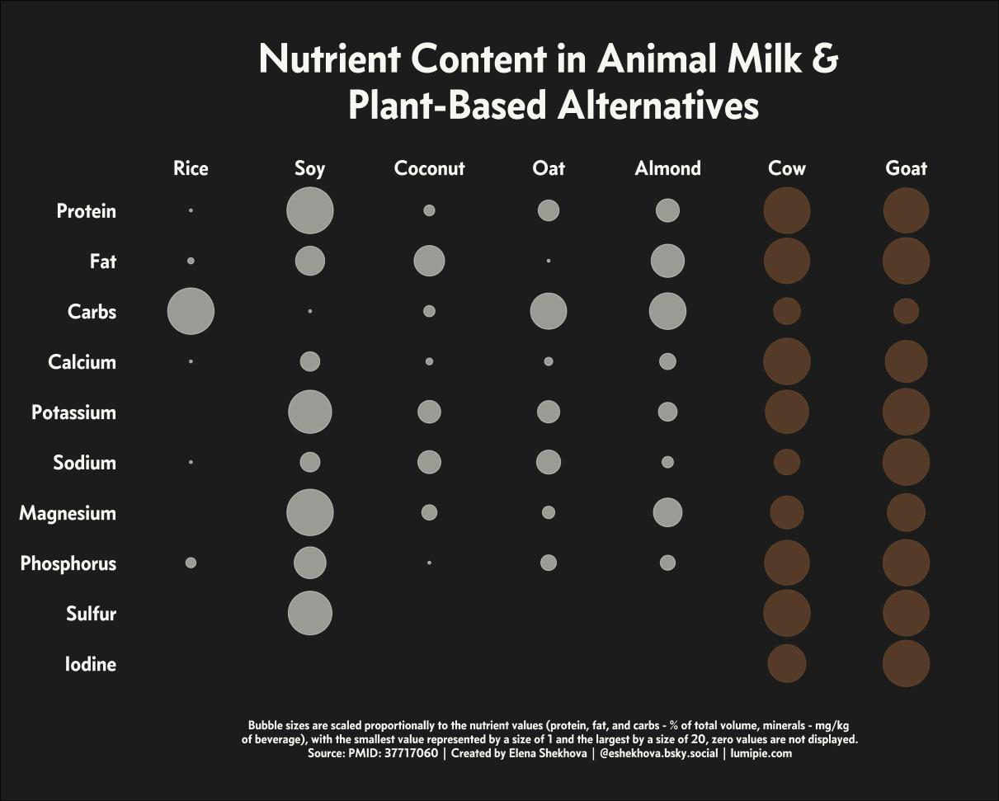
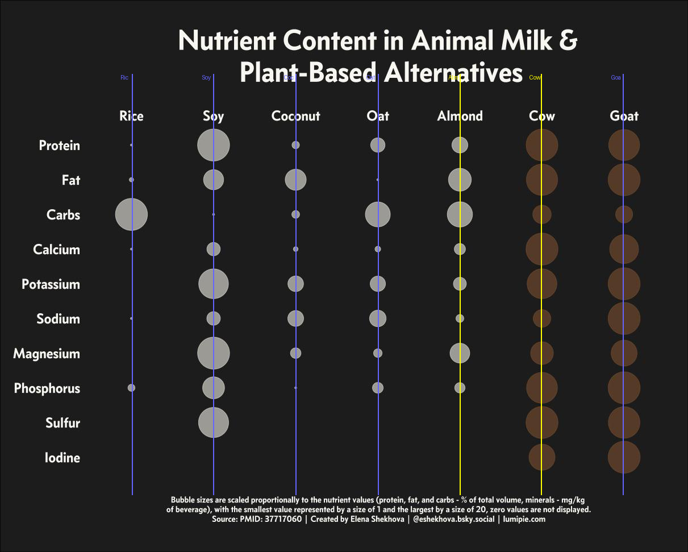
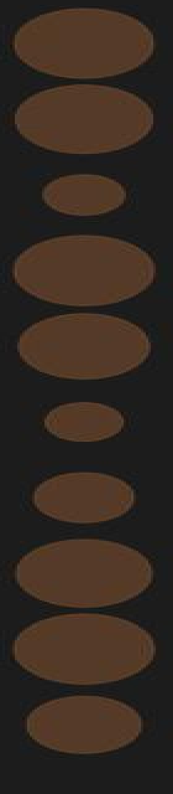
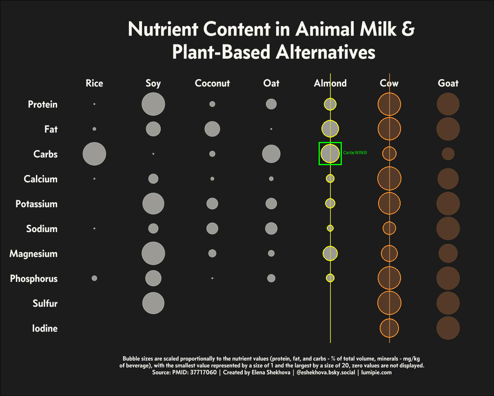

# Methodical Approach: q80 — Nutrient Content Bubble Chart

## Setup

**Model:** Claude Sonnet 4.6
**Harness:** `claude -p` (CLI print mode, non-interactive)
**Tools:** Read (view images), Bash (run Python scripts)
**Prompt:** Same methodical 4-step prompt (Analyze → Plan → Compute → Answer)

---

## The Problem

**Question:** What nutrient in the left most column is more prevalent in Almonds over 'Cow'?
**Gold answer:** Carbs
**Image:** `original.png`



A bubble chart on a dark background. Bubble size represents nutrient amount. The Cow and Goat columns use **brown bubbles** while all other columns use **gray bubbles** — this color difference is nearly invisible to visual-only approaches.

| Approach | Answer | Turns | Time |
|----------|--------|-------|------|
| Read only | **Magnesium** (wrong) | 6 | 93s |
| **Read+Bash+Plan** | **Carbs** (correct) | 33 | 449s |

---

## What the Model Did

### Step 1 — Analyze
Reads the image. Identifies a bubble chart: "Nutrient Content in Animal Milk & Plant-Based Alternatives." Rows = nutrients (Protein, Fat, Carbs, ..., Iodine). Columns = milk types (Rice, Soy, ..., Almond, Cow, Goat).

### Step 2 — Plan
> "Locate the Almond and Cow columns by x-coordinate. Measure bubble diameter in each row for both columns. Find which nutrient shows the largest Almond > Cow margin."

### Step 3 — Execute

**Detect columns** — Sums grayscale intensity along x-axis to find column centers. Annotates with vertical lines:



**Crop individual columns** — Extracts the Almond and Cow column strips for focused analysis:

 

**Discover the brown bubble problem** — Initial grayscale thresholding found **0 bright pixels** in the Cow column. The model investigated and discovered Cow bubbles are brown `RGB(85, 58, 41)` on a dark background — nearly invisible with standard detection. Switched to R-channel thresholding (`R > 50 and R > B + 15`).

**Measure bubble sizes** — For each nutrient row, measures the vertical extent (height in pixels) of bubbles in both columns:

```
Nutrient     | Almond | Cow  | Almond > Cow?
-------------|--------|------|---------------
Protein      |   30px | 57px | No
Fat          |   42px | 56px | No
Carbs        |   46px | 34px | YES (+12px)
Calcium      |   21px | 58px | No
Potassium    |   36px | 41px | No
Sodium       |   30px | 36px | No
Magnesium    |   36px | 41px | No
Phosphorus   |   30px | 36px | No
Sulfur       |    0px | 21px | No
Iodine       |    0px | 17px | No
```

**Carbs is the only nutrient where Almond (46px) > Cow (34px).**

**Annotate and verify** — Draws a green highlight box on the Carbs row in the final annotated image:



### Step 4 — Answer
> **Carbs** — the only nutrient where Almond's bubble is larger than Cow's, by a 12-pixel margin.

---

## Why Read-Only Failed

The Cow column uses **brown bubbles on a dark background** — low contrast that makes them appear smaller than they are. A visual-only model overestimates the Almond-vs-Cow gap across many nutrients, picking Magnesium (which looks bigger at a glance) instead of recognizing that Cow also has large brown bubbles for most nutrients. The computation caught this because it detected the brown color and measured actual pixel sizes, not perceived sizes.
